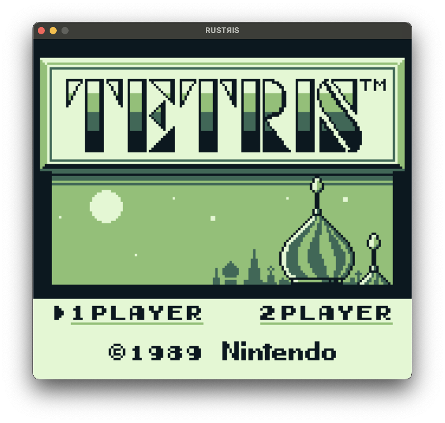
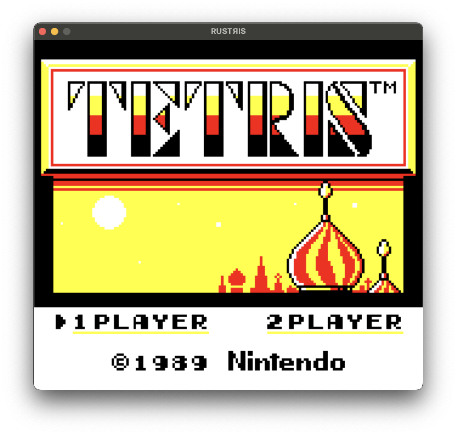

# RUSTЯIS  
**Rust Ultra Simple Tetris Emulator** — a Game Boy Tetris emulator written in Rust.

## About the Project
Rustris started as my first project in [Rust](https://www.rust-lang.org/), built with the goal of learning and practicing the language over the summer.  
Being passionate about retro computing, I wanted a project that was both fun and technically challenging — so I chose to recreate one of the most iconic handheld games ever: **Tetris for the Game Boy**.

It’s not intended to be the fastest or most feature-complete emulator. Instead, the focus is on writing **clear, maintainable, and educational Rust code**, exploring system-level concepts such as CPU emulation, memory mapping, and graphics rendering.

## Features
- Minimal Sharp LR35902 CPU core — implements only the opcodes exercised by **Tetris**.
- Simplified MMU (32 KB ROM only, no MBC), basic I/O, and joypad handling.
- Real-time, scanline-based renderer.
- Keyboard input mapped to Game Boy buttons.
- Small, modular codebase (CPU / MMU / PPU / GB façade / SDL front end).

## What’s missing / limitations
- No APU (audio) emulation.
- Timers not fully implemented: `DIV` (FF04) returns a pseudo-random byte; `TIMA/TAC` are unimplemented.
- No MBC or banked cartridges — only 32 KB ROMs are supported.
- Background rendering: honors SCX/SCY scrolling and selects BG map (0x9800/0x9C00) and tile data (0x8000 or 0x8800/0x9000) from LCDC. Window and tile priority/attributes are not implemented.
- Sprite rendering: supports 8×8 and 8×16 (per LCDC), handles X/Y flip and OBP0/OBP1; **color 0 is transparent; priority and other attributes are not handled**.
- Interrupts: only VBlank is serviced; STAT/Timer/Serial/Joypad IRQs are ignored.

## Installation & Usage

### 1. Clone and build the project
```bash
git clone https://github.com/ToniRamirezM/rustris.git
cd rustris
cargo build --release
```

Rustris requires [SDL2](https://www.libsdl.org/) to handle graphics and input.  
If you don’t have it installed, follow the official installation guide for your platform:  
[SDL2 Installation Instructions](https://wiki.libsdl.org/SDL2/Installation)

### 2. Run the emulator

Rustris requires a legal copy of the Game Boy *Tetris* ROM.  
To run it, place the ROM in the **same directory as the compiled executable** and name it exactly **tetris.gb**.


Then execute:

```bash
./rustris
```

or, if running via Cargo:

```bash
cargo run --release
```

The emulator will not start if the ROM is not named tetris.gb or if it is not found.

Press **Esc** or close the window to stop execution.

## Controls

| Game Boy Button | Key    |
| --------------- | ------ |
| A               | X      |
| B               | Z      |
| Start           | Return |
| Select          | Space  |
| Up              | ↑      |
| Down            | ↓      |
| Left            | ←      |
| Right           | →      |

It is also possible to toggle between the classic GB green screen or use the GB Color palette by pressing **P**.

<p align="center">
  
  
</p>

## Learning resources

* [Game Boy CPU Manual](https://gbdev.io/pandocs/CPU_Registers_and_Flags.html)
* [Pan Docs](https://gbdev.io/pandocs/)
* [The Rust Programming Language (The Book)](https://doc.rust-lang.org/book/)